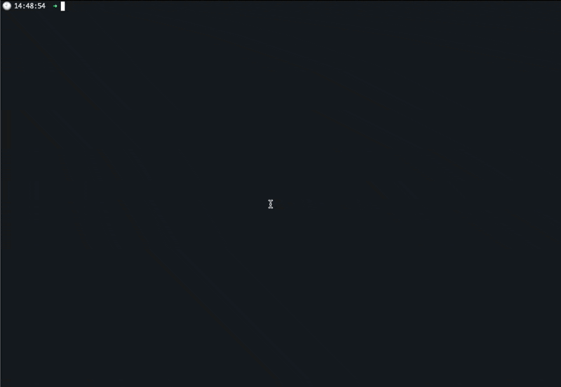

# CI for Data in BigQuery CLI utility

This CLI utility will help to orchestrate the process of creating Table Snapshots and Table Clones for the purpose of implementing changes inside the BigQuery Data Warehouse.

This tool automates parts of the process described in the document [CI For Data in BigQuery](https://cloud.google.com/architecture/REPLACE_LINK_HERE).

## Prerequisites
- Python 3+ (tested using Python 3.8.12)
- virtualenv (Recommended)

## Authentication
To run the utility you will need to authenticate using a service account. This can be accomplished either by running inside an authorized VM on GCP, or
setting the environment variable `GOOGLE_APPLICATION_CREDENTIALS` to a valid keyfile. See more
at [Authenticating as a service account](https://cloud.google.com/docs/authentication/production).

### Required Permissions
For the base dataset, where the original tables are residing:
- `bigquery.datasets.get`
- `bigquery.datasets.getData`
- `bigquery.tables.list`

To create a dataset:
- `bigquery.datasets.create`

On the dataset where the table clones and snapshots will reside:
- `bigquery.tables.create`
- `bigquery.tables.createSnapshot`

## The process
### A Gif is worth a thousand words

## In words
The CLI utility will ask for several inputs in order to coordinate a snapshot and clone creation, on which the developer can start implementing their changes in isolation. All clones and snapshots will be a "point-in-time".
On activation, the script will ask for the following:
1. A source project to select from a list of available projects (as assigned to the service account).
2. A source Dataset, from a list of datasets available in the source project.
3. A list of source tables. Multiple selection is possible, using the space key to select or deselect the options. The list of tables is fetched from the selected source dataset.
4. A target dataset. Either an existing one, or select the option to create a new dataset. In which case, the user will be prompted to enter a new dataset name. Validation of the new name is applied.
5. A datetime format, that will be used as a "Point-in-Time" for snapshot and clone creation. This must be a point in time in the last 7 days.
6. A final confirmation of all the details.

Upon confirmation, the script will create the target dataset if required, and create a snapshot and a clone for each table in the list provided. Each snapshot name will be in the form of `snap_<DATETIME>_<SOURCE_TABLE_NAME>` and each clone name will be in the format of `clone_<DATETIME>_<SOURCE_TABLE_NAME>`, where `DATETIME` will be in the format of 4 digits for the year and 2 digits for month, day, hour, minute & second.
e.g: for a source table of the name foo, a snapshot might be named `snap_20220317151941_foo` and the corresponding clone will be named `clone_20220317151941_foo`.

